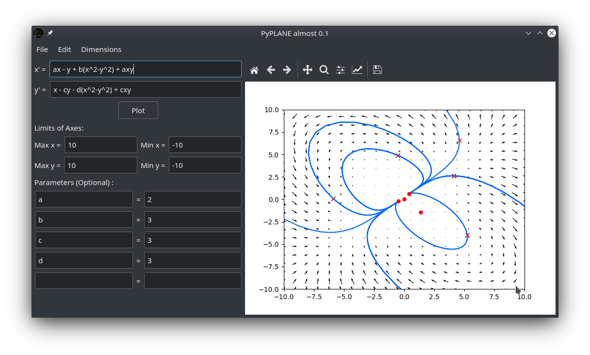
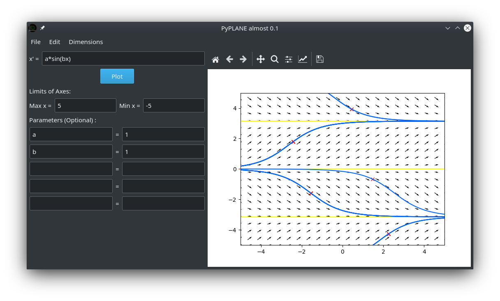

# PyPLANE

An open source replacement to the traditional DFIELD and PPLANE applications for solving systems of ODEs




## About

PyPLANE is an open source Python application used for the visualisation and (numerical/graphical) solving of systems of
ODEs. PyPLANE is released under the GPL-3.0

## Installing Pyplane

PyPLANE is available on the Snap Store for Linux

[](https://snapcraft.io/pyplane)

## Quick Start

If you are using Linux and have installed via the Snap store PyPLANE should appear in your application. If you use
Windows or Mac instead, or don't use the Snap store on Linux, you can clone the repository from GitHub and run the top-level
run.py file using Python 3. Note that you will need to have installed the following Python libraries for this method:
* NumPy
* SymPy
* SciPy
* Matplotlib
* PyQt5

The code snippet below will set up a Python environment to run PyPLANE in isolation without affecting the global Python
install. The required libraries listed above will also be installed:

#### Linux
```bash
python3 -m venv pyplanedev/
mkdir -p pyplanedev/master
git clone https://github.com/m-squared96/PyPLANE pyplanedev/master
cd pyplanedev/master
git checkout master
source ../bin/activate
pip install -r requirements.txt
```

PyPLANE can then be launched using:
```bash
cd /path/to/pyplanedev/master
python3 run.py
```

One way or another, you should now have launched PyPLANE!

## Quick User Guide

### The Phase Space Plot
The phase space plot on the right hand side of the application GUI can be interfaced directly with the mouse. By
double-clicking on the plot a trajectory is plotted, with the click-coordinates used as an initial condition.

Furthermore, nullclines and fixed points can be toggle on/off from the Edit menu.

### Editing the System
One of PyPLANE's main features is its ability to analyse both one- and two-dimensional systems. To change the number of
dimensions select the appropriate option from the Dimensions menu.

On the one-dimensional interface, the only dependent variable is x, with the independent variable being t. For two
dimensions the dependent variables are x and y. 

In the text box(es) in the top left of the screen, the user can define the expressions used for the system's
derivative(s). Any symbols in the text boxes should conform to one of the points below:
* Mathematical operators/functions (i.e. +,-,*,/,sin,cos etc.);
* References to the dependent or independent variables (t,x,y);
* References to parameters;

Parameters are constants which can take any value; they can be edited in the text boxes provided below the axes limits.
Any constant parameters referenced in the derivative definitions should be defined in the boxes provided.
